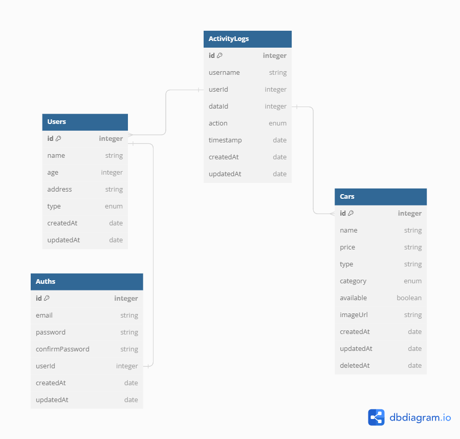

# Challenge Chapter 05 FSW Binar Academy x KM Batch 5

This project is for completing chapter 5 challenge "Car Management API".

## Installation

You need to install NodeJS, NPM, and PostgreSQL on your system first.

## Run Locally

To run this project, you will need to add the environment variables to your .env file (see .env-example)

Clone the project

```bash
  git clone https://github.com/ukinon/Challenge-Chapter-05-Car-Management-API.git
```

Go to the project directory

```bash
  cd Challenge-Chapter-05
```

Install dependencies

```bash
  npm install
```

Start the server

```bash
  npm run dev
```

You can access your app at https://localhost:port

## ERD



## Superuser data

```
1. email: papa@gmail.com
password: bogor123
2. email: papi@gmail.com
password: tangerang123
3. email: papo@gmail.com
password: jakarta123
```

## Links

### OpenAPI Documentation Page

```http
http://localhost:PORT/api/docs
```

## Notes

1. Endpoint CRUD Cars hanya dapat diakses oleh admin/superadmin
2. Endpoint register admin hanya dapat diakses oleh superadmin
3. Yang dapat edit/delete data user hanyalah user yang memiliki akun tersebut atau user yang memiliki role yang lebih tinggi
